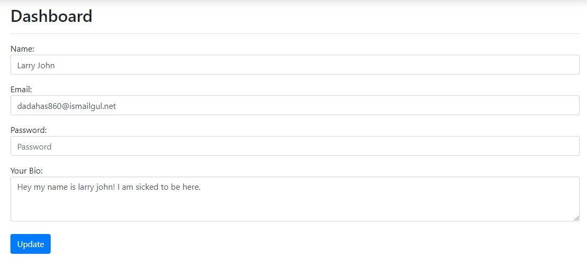
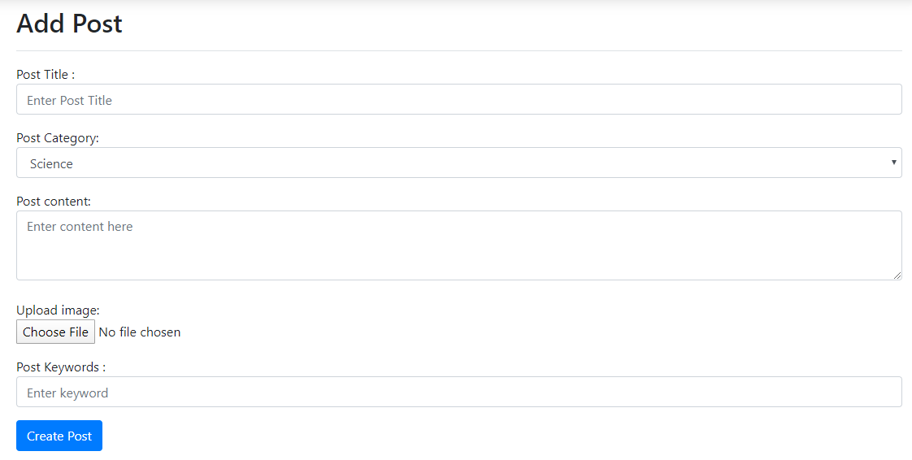
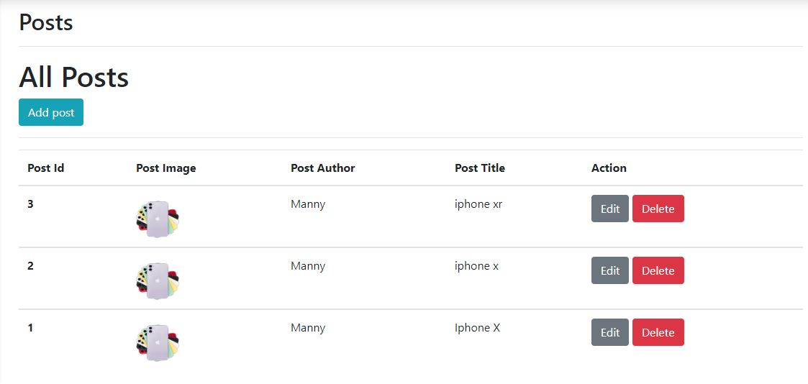

# My Dynamic Blog
A blogging website where people can sign up and post about whatever they like.

### To create a post a user needs to log in first.
By default user has author role. An author can 

* Add/edit information about himself 
   - His Name
   - His Password
   - His Email
   - His Bio

* Add a post

    
* See all posts

### From database Admin role can be assigned to user.

Admins can

* Add/ edit information about himself 
   - Name
   - Password
   - Email
   - Bio
* See all posts
* Add a post
* Make changes to a post
   - Edit a post
   - Delete a post

    

I will edit this readme as i add more things to the site and a live version of the website will also be avaialble soon!
